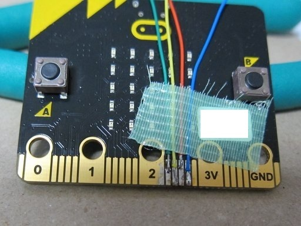
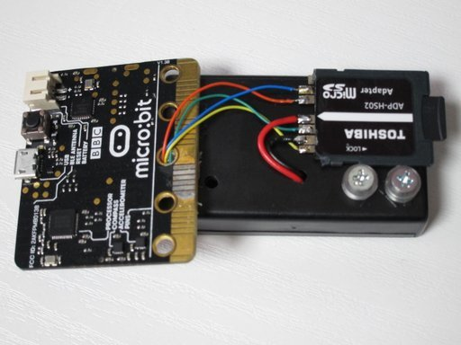
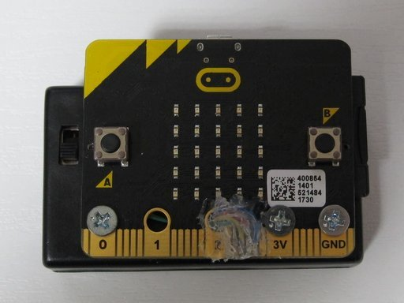
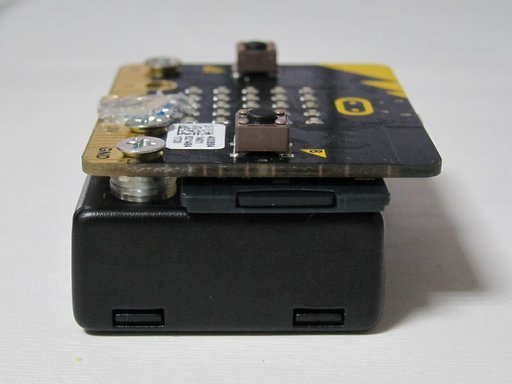

# SD カードのテスト

SPI 機能を使って SD カードにアクセスします。
SPI の制御は[ここ](https://os.mbed.com/users/mbed_official/code/SDFileSystem/)を参考にしました。  
ファイルシステムにアクセスするために [FatFs](http://elm-chan.org/fsw/ff/00index_e.html) を使っています。

## テスト内容
SD カード内の```def.h```の内容を16進数でシリアルポートに出力します。  
今はまだ、読み出ししかできません。

## 実行法
下のコマンドを打ってプロジェクトを作成します。

```
yotta init
yotta target bbc-microbit-classic-gcc
yotta install lancaster-university/microbit

```

メモリの節約と radio 機能を使うために BLE 機能は OFF にします。  
yotta_modules/microbit-dal/inc/core/MicroBitConfig.h の中で、

```
#define MICROBIT_BLE_ENABLED                    0
```

コンパイルします。

```
yotta build
```


## アダプタと電池Boxを取り付ける
micro:bit 側は一枚目の写真のように接続して2番の穴にケーブルを通して裏側に出し、SD カードアダプタ側は2番目の写真のように接続します。ちょっと太めのケーブルは電源なので、電池 BOX の中に引き込みます。そして、SD カードアダプタを電池 BOX に接着剤で固定します。


  
そのあと、絶縁と保護を兼ねてグルーガンでべたべたに固めて、電池 BOX にねじ止めします。写真ないけど SD カード側も固めます。電池 Box の中で電源ケーブルとネジをつなぎます。
スペーサ代わりにポリのワッシャを 4 枚重ねます。


  
